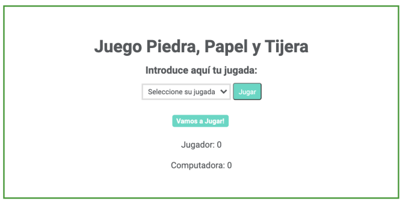

# rock-paper-scissors

## Ejercicio realizado en Adalab

[Échale un vistazo](https://begodpo.github.io/rock-paper-scissors/)

### Enunciado del ejercicio
El ejercicio consiste en desarrollar el juego "Piedra, Papel y Tijera". En el juego ambos jugadores tienen que
hacer una piedra, papel o tijeras. Solo tiene dos resultados posibles: un empate o una victoria para un
jugador y una derrota para el otro jugador. Diseñaremos el juego usando JavaScript donde un jugador
jugará contra la computadora.

**Descripción**

El programa genera un movimiento al azar entre papel, piedra y tijera (las indicaciones para generar el
movimiento al azar están más adelante). Posteriormente la usuaria juega, el programa compara los
movimientos y decide si la usuaria ha ganado, perdido o empatado contra el ordenador. También a su vez el
programa va contabilizando el número de puntos del jugador y del ordenador. El juego se reinicia se
realicen 10 movimientos.

**Indicaciones**

- En la parte superior, la jugadora selecciona la jugada del desplegable. Las opciones son Piedra,
Papel y Tijera
- Debajo, en el próximo apartado aparecen los siguientes textos:
  - Al arrancar la página: ¡Vamos a Jugar!.
  - Cuando la jugadora introduzca un movimiento que coincida con al movimiento aleatorio se
muestra el mensaje: Empate.
  - Cuando la jugadora introduzca un movimiento que gane al movimiento aleatorio se muestra el
mensaje: ¡Has Ganado!.
  - Cuando la jugadora introduzca un movimiento que falle al movimiento aleatorio se muestra el
mensaje: ¡Has perdido!.
- En la parte inferior debe aparecer los puntos de cada jugador.

**Bonus**

- El juego finaliza cuando llega a 10 movimientos, agrega el código necesario para que se muestre un
botón Reiniciar Juego que vuelva a iniciar el juego cuando se cumpla esta condición y desaparezca
el botón de Jugar.
- Cuando le demos click a al botón Reiniciar Juego desaparece este botón, poner todos los
contadores a cero y vuelve a aparecer el botón Jugar

